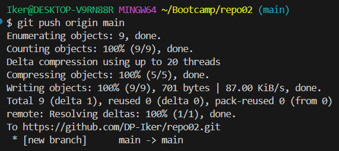

# Repo02

### 2.1  
Se el considera repositorio remoto  

### 2.3
  


### 2.4
#### Inicializar repositorio en local
```bash
git init directorio
``` 
#### Clonar repositorio remoto
```bash
git clone repositoriogit
```

#### Añadir todos los archivos a staged
```bash
git add .
```

#### Quitar de staged
```bash
git rm nombrearchivo
```

#### Ver el estado de los archivos a guardar
```bash
git status
```

#### Ver el repositorio remoto casociado
```bash
git remote -v
```

#### Subir los cambios del repositorio local al remoto
```bash
git push
```

#### Subir los cambios al repositorio remoto si éste no tiene la rama afectada
```bash
git push -u origin main
```

#### Bajar datos del repositorio remoto
```bash
git pull
```

#### Ver historial de cambios del repositorio
```bash
git log
```

#### Ver historial de cambios del repositorio en formato adog
```bash
git log --all --decorate --oneline --graph
```